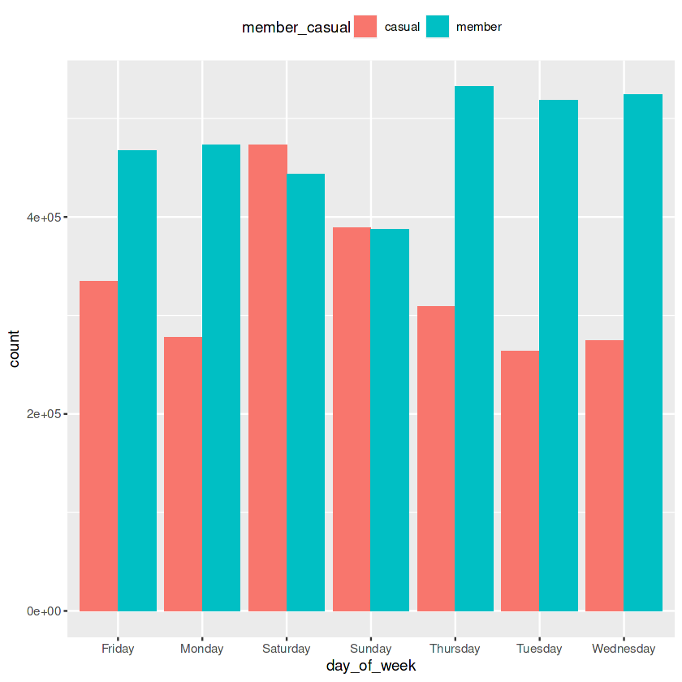
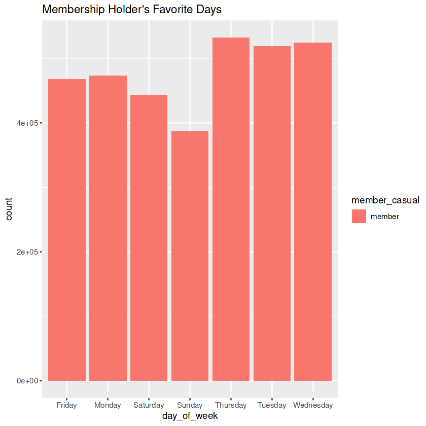
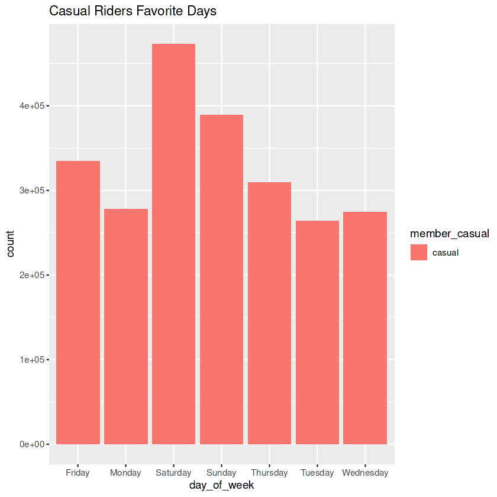
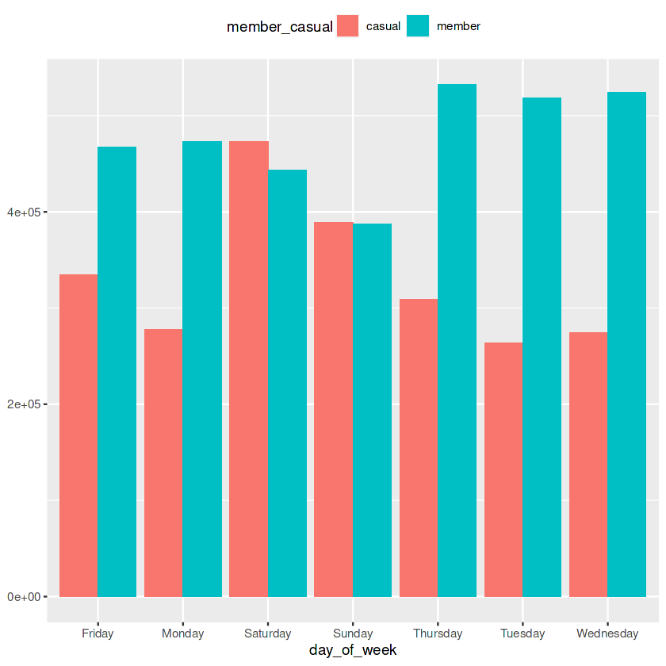
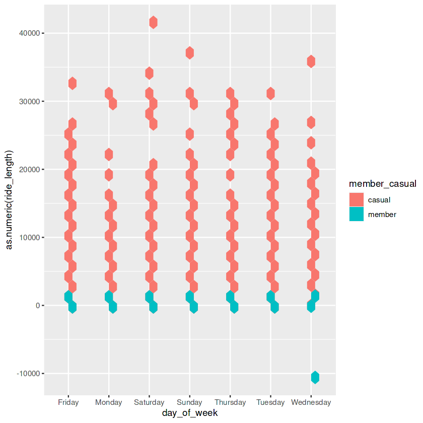
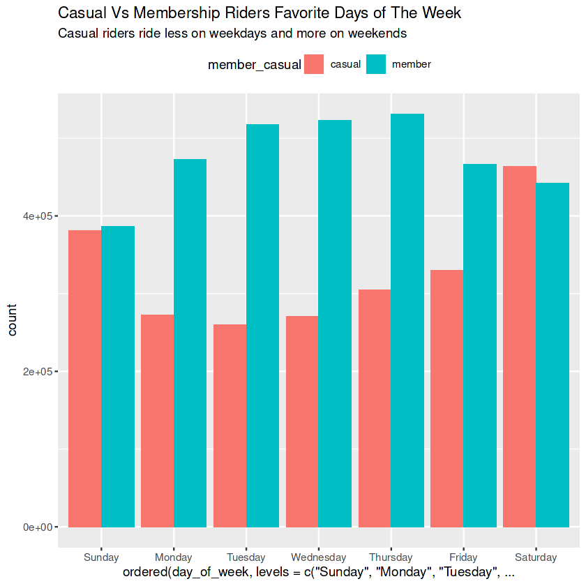
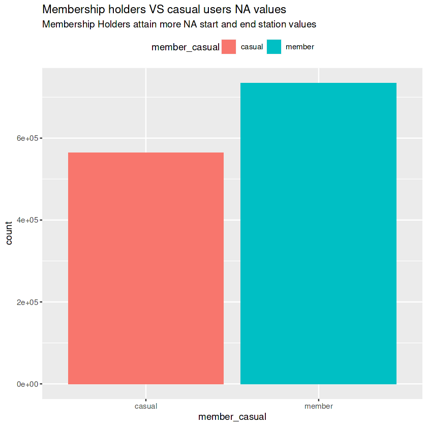

---
jupyter:
  kernelspec:
    display_name: R
    language: R
    name: ir
  language_info:
    codemirror_mode: r
    file_extension: .r
    mimetype: text/x-r-source
    name: R
    pygments_lexer: r
    version: 4.0.5
  nbformat: 4
  nbformat_minor: 5
  papermill:
    default_parameters: {}
    duration: 131.547228
    end_time: "2023-09-23T01:53:19.322671"
    environment_variables: {}
    input_path: \_\_notebook\_\_.ipynb
    output_path: \_\_notebook\_\_.ipynb
    parameters: {}
    start_time: "2023-09-23T01:51:07.775443"
    version: 2.4.0
---

::: {#d9348f1a .cell .markdown papermill="{\"duration\":1.355e-2,\"end_time\":\"2023-09-23T01:51:11.454808\",\"exception\":false,\"start_time\":\"2023-09-23T01:51:11.441258\",\"status\":\"completed\"}" tags="[]"}
# Introduction

This main goal of this project is to analyze the many ways that
membership holders and casual users differ from one another. This
project is a part of the Google Data Analytics Professional Certificate
and draws upon a data set from a fictional bike sharing company
*Cyclistic*. The data is composed of rider information over 2022.

## Key Tasks

-   Our main goal is to convert more casual riders into membership
    holders by better understanding how the two differ from one another.
-   Namely, we want to understand how the bikes are used differently
    between the two types of riders.
:::

::: {#9c0259ce .cell .code execution_count="1" _execution_state="idle" _uuid="051d70d956493feee0c6d64651c6a088724dca2a" execution="{\"iopub.execute_input\":\"2023-09-23T01:51:11.485270Z\",\"iopub.status.busy\":\"2023-09-23T01:51:11.482831Z\",\"iopub.status.idle\":\"2023-09-23T01:51:12.790469Z\",\"shell.execute_reply\":\"2023-09-23T01:51:12.788530Z\"}" papermill="{\"duration\":1.324526,\"end_time\":\"2023-09-23T01:51:12.793291\",\"exception\":false,\"start_time\":\"2023-09-23T01:51:11.468765\",\"status\":\"completed\"}" tags="[]"}
``` R
#loading tidyverse
library(tidyverse) # metapackage of all tidyverse packages
#Listing all data in folders
list.files(path = "../input/bike-share-trip-data")
#R was unable to locate our CSVs and was looking in working directory
#As a bandaid on the wound I decided to change the working directory until
#a more permanent fix can be found
setwd("../input/bike-share-trip-data")
```

::: {.output .stream .stderr}
    ── Attaching core tidyverse packages ──────────────────────── tidyverse 2.0.0 ──
    ✔ dplyr     1.1.2     ✔ readr     2.1.4
    ✔ forcats   1.0.0     ✔ stringr   1.5.0
    ✔ ggplot2   3.4.2     ✔ tibble    3.2.1
    ✔ lubridate 1.9.2     ✔ tidyr     1.3.0
    ✔ purrr     1.0.1     
    ── Conflicts ────────────────────────────────────────── tidyverse_conflicts() ──
    ✖ dplyr::filter() masks stats::filter()
    ✖ dplyr::lag()    masks stats::lag()
    ℹ Use the conflicted package (<http://conflicted.r-lib.org/>) to force all conflicts to become errors
:::

::: {.output .display_data}
1. '202201-divvy-tripdata.csv'
2. '202202-divvy-tripdata.csv'
3. '202203-divvy-tripdata.csv'
4. '202204-divvy-tripdata.csv'
5. '202205-divvy-tripdata.csv'
6. '202206-divvy-tripdata.csv'
7. '202207-divvy-tripdata.csv'
8. '202208-divvy-tripdata.csv'
9. '202209-divvy-tripdata.csv'
10. '202210-divvy-tripdata.csv'
11. '202211-divvy-tripdata.csv'
12. '202212-divvy-tripdata.csv'
:::
:::

::: {#6ec6f455 .cell .markdown papermill="{\"duration\":1.2779e-2,\"end_time\":\"2023-09-23T01:51:12.818739\",\"exception\":false,\"start_time\":\"2023-09-23T01:51:12.805960\",\"status\":\"completed\"}" tags="[]"}
# Preparing and Cleaning our data

Rather than using read_csv() 12 times I decided to impliment a function
to assign all of our CSV files into one data frame
:::

::: {#1d563d96 .cell .code execution_count="2" execution="{\"iopub.execute_input\":\"2023-09-23T01:51:12.879341Z\",\"iopub.status.busy\":\"2023-09-23T01:51:12.845919Z\",\"iopub.status.idle\":\"2023-09-23T01:51:51.126322Z\",\"shell.execute_reply\":\"2023-09-23T01:51:51.124293Z\"}" papermill="{\"duration\":38.299157,\"end_time\":\"2023-09-23T01:51:51.130506\",\"exception\":false,\"start_time\":\"2023-09-23T01:51:12.831349\",\"status\":\"completed\"}" tags="[]"}
``` R
#Reading in all of our data
#Only works when working directory is the ../input/bike-share... folder
df <-
  list.files(path = "/kaggle/input/bike-share-trip-data", pattern = "*.csv") %>% 
  map_df(~read_csv(.))
```

::: {.output .stream .stderr}
    Rows: 103770 Columns: 13
    ── Column specification ────────────────────────────────────────────────────────
    Delimiter: ","
    chr  (7): ride_id, rideable_type, start_station_name, start_station_id, end_...
    dbl  (4): start_lat, start_lng, end_lat, end_lng
    dttm (2): started_at, ended_at

    ℹ Use `spec()` to retrieve the full column specification for this data.
    ℹ Specify the column types or set `show_col_types = FALSE` to quiet this message.
    Rows: 115609 Columns: 13
    ── Column specification ────────────────────────────────────────────────────────
    Delimiter: ","
    chr  (7): ride_id, rideable_type, start_station_name, start_station_id, end_...
    dbl  (4): start_lat, start_lng, end_lat, end_lng
    dttm (2): started_at, ended_at

    ℹ Use `spec()` to retrieve the full column specification for this data.
    ℹ Specify the column types or set `show_col_types = FALSE` to quiet this message.
    Rows: 284042 Columns: 13
    ── Column specification ────────────────────────────────────────────────────────
    Delimiter: ","
    chr  (7): ride_id, rideable_type, start_station_name, start_station_id, end_...
    dbl  (4): start_lat, start_lng, end_lat, end_lng
    dttm (2): started_at, ended_at

    ℹ Use `spec()` to retrieve the full column specification for this data.
    ℹ Specify the column types or set `show_col_types = FALSE` to quiet this message.
    Rows: 371249 Columns: 13
    ── Column specification ────────────────────────────────────────────────────────
    Delimiter: ","
    chr  (7): ride_id, rideable_type, start_station_name, start_station_id, end_...
    dbl  (4): start_lat, start_lng, end_lat, end_lng
    dttm (2): started_at, ended_at

    ℹ Use `spec()` to retrieve the full column specification for this data.
    ℹ Specify the column types or set `show_col_types = FALSE` to quiet this message.
    Rows: 634858 Columns: 13
    ── Column specification ────────────────────────────────────────────────────────
    Delimiter: ","
    chr  (7): ride_id, rideable_type, start_station_name, start_station_id, end_...
    dbl  (4): start_lat, start_lng, end_lat, end_lng
    dttm (2): started_at, ended_at

    ℹ Use `spec()` to retrieve the full column specification for this data.
    ℹ Specify the column types or set `show_col_types = FALSE` to quiet this message.
    Rows: 769204 Columns: 13
    ── Column specification ────────────────────────────────────────────────────────
    Delimiter: ","
    chr  (7): ride_id, rideable_type, start_station_name, start_station_id, end_...
    dbl  (4): start_lat, start_lng, end_lat, end_lng
    dttm (2): started_at, ended_at

    ℹ Use `spec()` to retrieve the full column specification for this data.
    ℹ Specify the column types or set `show_col_types = FALSE` to quiet this message.
    Rows: 823488 Columns: 13
    ── Column specification ────────────────────────────────────────────────────────
    Delimiter: ","
    chr  (7): ride_id, rideable_type, start_station_name, start_station_id, end_...
    dbl  (4): start_lat, start_lng, end_lat, end_lng
    dttm (2): started_at, ended_at

    ℹ Use `spec()` to retrieve the full column specification for this data.
    ℹ Specify the column types or set `show_col_types = FALSE` to quiet this message.
    Rows: 785932 Columns: 13
    ── Column specification ────────────────────────────────────────────────────────
    Delimiter: ","
    chr  (7): ride_id, rideable_type, start_station_name, start_station_id, end_...
    dbl  (4): start_lat, start_lng, end_lat, end_lng
    dttm (2): started_at, ended_at

    ℹ Use `spec()` to retrieve the full column specification for this data.
    ℹ Specify the column types or set `show_col_types = FALSE` to quiet this message.
    Rows: 701339 Columns: 13
    ── Column specification ────────────────────────────────────────────────────────
    Delimiter: ","
    chr  (7): ride_id, rideable_type, start_station_name, start_station_id, end_...
    dbl  (4): start_lat, start_lng, end_lat, end_lng
    dttm (2): started_at, ended_at

    ℹ Use `spec()` to retrieve the full column specification for this data.
    ℹ Specify the column types or set `show_col_types = FALSE` to quiet this message.
    Rows: 558685 Columns: 13
    ── Column specification ────────────────────────────────────────────────────────
    Delimiter: ","
    chr  (7): ride_id, rideable_type, start_station_name, start_station_id, end_...
    dbl  (4): start_lat, start_lng, end_lat, end_lng
    dttm (2): started_at, ended_at

    ℹ Use `spec()` to retrieve the full column specification for this data.
    ℹ Specify the column types or set `show_col_types = FALSE` to quiet this message.
    Rows: 337735 Columns: 13
    ── Column specification ────────────────────────────────────────────────────────
    Delimiter: ","
    chr  (7): ride_id, rideable_type, start_station_name, start_station_id, end_...
    dbl  (4): start_lat, start_lng, end_lat, end_lng
    dttm (2): started_at, ended_at

    ℹ Use `spec()` to retrieve the full column specification for this data.
    ℹ Specify the column types or set `show_col_types = FALSE` to quiet this message.
    Rows: 181806 Columns: 13
    ── Column specification ────────────────────────────────────────────────────────
    Delimiter: ","
    chr  (7): ride_id, rideable_type, start_station_name, start_station_id, end_...
    dbl  (4): start_lat, start_lng, end_lat, end_lng
    dttm (2): started_at, ended_at

    ℹ Use `spec()` to retrieve the full column specification for this data.
    ℹ Specify the column types or set `show_col_types = FALSE` to quiet this message.
:::
:::

::: {#1734c344 .cell .markdown papermill="{\"duration\":1.6214e-2,\"end_time\":\"2023-09-23T01:51:51.169021\",\"exception\":false,\"start_time\":\"2023-09-23T01:51:51.152807\",\"status\":\"completed\"}" tags="[]"}
You may notice that we have to switch directories a few times. This is a
draw back to the function above. It saved us time but we need to be wary
of our working directory.
:::

::: {#33543943 .cell .code execution_count="3" execution="{\"iopub.execute_input\":\"2023-09-23T01:51:51.204807Z\",\"iopub.status.busy\":\"2023-09-23T01:51:51.202949Z\",\"iopub.status.idle\":\"2023-09-23T01:51:51.262813Z\",\"shell.execute_reply\":\"2023-09-23T01:51:51.260626Z\"}" papermill="{\"duration\":8.126e-2,\"end_time\":\"2023-09-23T01:51:51.266128\",\"exception\":false,\"start_time\":\"2023-09-23T01:51:51.184868\",\"status\":\"completed\"}" tags="[]"}
``` R
#Switching back to our initial directory
head(df)
setwd('/kaggle/working/')
```

::: {.output .display_data}

A tibble: 6 × 13

| ride_id &lt;chr&gt; | rideable_type &lt;chr&gt; | started_at &lt;dttm&gt; | ended_at &lt;dttm&gt; | start_station_name &lt;chr&gt; | start_station_id &lt;chr&gt; | end_station_name &lt;chr&gt; | end_station_id &lt;chr&gt; | start_lat &lt;dbl&gt; | start_lng &lt;dbl&gt; | end_lat &lt;dbl&gt; | end_lng &lt;dbl&gt; | member_casual &lt;chr&gt; |
|---|---|---|---|---|---|---|---|---|---|---|---|---|
| C2F7DD78E82EC875 | electric_bike | 2022-01-13 11:59:47 | 2022-01-13 12:02:44 | Glenwood Ave &amp; Touhy Ave      | 525          | Clark St &amp; Touhy Ave          | RP-007       | 42.01280 | -87.66591 | 42.01256 | -87.67437 | casual |
| A6CF8980A652D272 | electric_bike | 2022-01-10 08:41:56 | 2022-01-10 08:46:17 | Glenwood Ave &amp; Touhy Ave      | 525          | Clark St &amp; Touhy Ave          | RP-007       | 42.01276 | -87.66597 | 42.01256 | -87.67437 | casual |
| BD0F91DFF741C66D | classic_bike  | 2022-01-25 04:53:40 | 2022-01-25 04:58:01 | Sheffield Ave &amp; Fullerton Ave | TA1306000016 | Greenview Ave &amp; Fullerton Ave | TA1307000001 | 41.92560 | -87.65371 | 41.92533 | -87.66580 | member |
| CBB80ED419105406 | classic_bike  | 2022-01-04 00:18:04 | 2022-01-04 00:33:00 | Clark St &amp; Bryn Mawr Ave      | KA1504000151 | Paulina St &amp; Montrose Ave     | TA1309000021 | 41.98359 | -87.66915 | 41.96151 | -87.67139 | casual |
| DDC963BFDDA51EEA | classic_bike  | 2022-01-20 01:31:10 | 2022-01-20 01:37:12 | Michigan Ave &amp; Jackson Blvd   | TA1309000002 | State St &amp; Randolph St        | TA1305000029 | 41.87785 | -87.62408 | 41.88462 | -87.62783 | member |
| A39C6F6CC0586C0B | classic_bike  | 2022-01-11 18:48:09 | 2022-01-11 18:51:31 | Wood St &amp; Chicago Ave         | 637          | Honore St &amp; Division St       | TA1305000034 | 41.89563 | -87.67207 | 41.90312 | -87.67394 | member |
:::
:::

::: {#602535e1 .cell .code execution_count="4" execution="{\"iopub.execute_input\":\"2023-09-23T01:51:51.303628Z\",\"iopub.status.busy\":\"2023-09-23T01:51:51.301738Z\",\"iopub.status.idle\":\"2023-09-23T01:51:56.250833Z\",\"shell.execute_reply\":\"2023-09-23T01:51:56.248178Z\"}" papermill="{\"duration\":4.971686,\"end_time\":\"2023-09-23T01:51:56.253980\",\"exception\":false,\"start_time\":\"2023-09-23T01:51:51.282294\",\"status\":\"completed\"}" tags="[]"}
``` R
#Adding length of trip and day of week it took place to our data frame
day_week <- weekdays(as.Date(df$started_at))
df2 = df %>%
mutate(ride_length = round(difftime(ended_at, started_at, units = "min"),2),day_of_week = day_week)
head(df2)
```

::: {.output .display_data}

A tibble: 6 × 15

| ride_id &lt;chr&gt; | rideable_type &lt;chr&gt; | started_at &lt;dttm&gt; | ended_at &lt;dttm&gt; | start_station_name &lt;chr&gt; | start_station_id &lt;chr&gt; | end_station_name &lt;chr&gt; | end_station_id &lt;chr&gt; | start_lat &lt;dbl&gt; | start_lng &lt;dbl&gt; | end_lat &lt;dbl&gt; | end_lng &lt;dbl&gt; | member_casual &lt;chr&gt; | ride_length &lt;drtn&gt; | day_of_week &lt;chr&gt; |
|---|---|---|---|---|---|---|---|---|---|---|---|---|---|---|
| C2F7DD78E82EC875 | electric_bike | 2022-01-13 11:59:47 | 2022-01-13 12:02:44 | Glenwood Ave &amp; Touhy Ave      | 525          | Clark St &amp; Touhy Ave          | RP-007       | 42.01280 | -87.66591 | 42.01256 | -87.67437 | casual |  2.95 mins | Thursday |
| A6CF8980A652D272 | electric_bike | 2022-01-10 08:41:56 | 2022-01-10 08:46:17 | Glenwood Ave &amp; Touhy Ave      | 525          | Clark St &amp; Touhy Ave          | RP-007       | 42.01276 | -87.66597 | 42.01256 | -87.67437 | casual |  4.35 mins | Monday   |
| BD0F91DFF741C66D | classic_bike  | 2022-01-25 04:53:40 | 2022-01-25 04:58:01 | Sheffield Ave &amp; Fullerton Ave | TA1306000016 | Greenview Ave &amp; Fullerton Ave | TA1307000001 | 41.92560 | -87.65371 | 41.92533 | -87.66580 | member |  4.35 mins | Tuesday  |
| CBB80ED419105406 | classic_bike  | 2022-01-04 00:18:04 | 2022-01-04 00:33:00 | Clark St &amp; Bryn Mawr Ave      | KA1504000151 | Paulina St &amp; Montrose Ave     | TA1309000021 | 41.98359 | -87.66915 | 41.96151 | -87.67139 | casual | 14.93 mins | Tuesday  |
| DDC963BFDDA51EEA | classic_bike  | 2022-01-20 01:31:10 | 2022-01-20 01:37:12 | Michigan Ave &amp; Jackson Blvd   | TA1309000002 | State St &amp; Randolph St        | TA1305000029 | 41.87785 | -87.62408 | 41.88462 | -87.62783 | member |  6.03 mins | Thursday |
| A39C6F6CC0586C0B | classic_bike  | 2022-01-11 18:48:09 | 2022-01-11 18:51:31 | Wood St &amp; Chicago Ave         | 637          | Honore St &amp; Division St       | TA1305000034 | 41.89563 | -87.67207 | 41.90312 | -87.67394 | member |  3.37 mins | Tuesday  |
:::
:::

::: {#98dbee47 .cell .code execution_count="5" execution="{\"iopub.execute_input\":\"2023-09-23T01:51:56.291420Z\",\"iopub.status.busy\":\"2023-09-23T01:51:56.289566Z\",\"iopub.status.idle\":\"2023-09-23T01:51:57.151806Z\",\"shell.execute_reply\":\"2023-09-23T01:51:57.149565Z\"}" papermill="{\"duration\":0.883855,\"end_time\":\"2023-09-23T01:51:57.154405\",\"exception\":false,\"start_time\":\"2023-09-23T01:51:56.270550\",\"status\":\"completed\"}" tags="[]"}
``` R
#Counting membership holders
df2 %>%
count(member_casual)
#Checking for NA values
test <- as.character(unlist(strsplit(colnames(df2), split=" ")))
for (i in test){
    cat(sum(is.na(df2[[i]]))," NAs inside of",i,"\n")
}
```

::: {.output .display_data}

A tibble: 2 × 2

| member_casual &lt;chr&gt; | n &lt;int&gt; |
|---|---|
| casual | 2322032 |
| member | 3345685 |
:::

::: {.output .stream .stdout}
    0  NAs inside of ride_id 
    0  NAs inside of rideable_type 
    0  NAs inside of started_at 
    0  NAs inside of ended_at 
    833064  NAs inside of start_station_name 
    833064  NAs inside of start_station_id 
    892742  NAs inside of end_station_name 
    892742  NAs inside of end_station_id 
    0  NAs inside of start_lat 
    0  NAs inside of start_lng 
    5858  NAs inside of end_lat 
    5858  NAs inside of end_lng 
    0  NAs inside of member_casual 
    0  NAs inside of ride_length 
    0  NAs inside of day_of_week 
:::
:::

::: {#ed2c0816 .cell .markdown papermill="{\"duration\":1.6728e-2,\"end_time\":\"2023-09-23T01:51:57.187827\",\"exception\":false,\"start_time\":\"2023-09-23T01:51:57.171099\",\"status\":\"completed\"}" tags="[]"}
# Summarizing our data

-   In our data exploration we find that we attain significant outliers
    in ride length.
-   Without accounting for outliers, our most common riding day is
    saturday and the average ride lasts for about 20 minutes for both
    member holders and casual riders.
:::

::: {#a2e38e98 .cell .code execution_count="6" execution="{\"iopub.execute_input\":\"2023-09-23T01:51:57.225332Z\",\"iopub.status.busy\":\"2023-09-23T01:51:57.223681Z\",\"iopub.status.idle\":\"2023-09-23T01:51:57.855487Z\",\"shell.execute_reply\":\"2023-09-23T01:51:57.853020Z\"}" papermill="{\"duration\":0.654456,\"end_time\":\"2023-09-23T01:51:57.859061\",\"exception\":false,\"start_time\":\"2023-09-23T01:51:57.204605\",\"status\":\"completed\"}" tags="[]"}
``` R
#Tallying all days of the week
tallied <- df2 %>% 
    group_by(day_of_week) %>% 
    summarize(frequency = n()) %>% 
    ungroup()
#Mode of all days of the week
mode_day_week <- tallied %>%
    filter(frequency == max(frequency)) %>%
    summarize(mode_day_week = day_of_week)
#summarizing our data
summary_of_df2 <- df2 %>%
    summarize(avg_ride_len = mean(ride_length), min_ride_len = min(ride_length), max_ride_len = max(ride_length)) %>%
    mutate(mode_day_week)
tallied
summary_of_df2
```

::: {.output .display_data}

A tibble: 7 × 2

| day_of_week &lt;chr&gt; | frequency &lt;int&gt; |
|---|---|
| Friday    | 801787 |
| Monday    | 751014 |
| Saturday  | 916471 |
| Sunday    | 776259 |
| Thursday  | 841591 |
| Tuesday   | 782372 |
| Wednesday | 798223 |
:::

::: {.output .display_data}

A tibble: 1 × 4

| avg_ride_len &lt;drtn&gt; | min_ride_len &lt;drtn&gt; | max_ride_len &lt;drtn&gt; | mode_day_week &lt;chr&gt; |
|---|---|---|---|
| 19.44328 mins | -10353.35 mins | 41387.25 mins | Saturday |
:::
:::

::: {#347d9d2e .cell .markdown papermill="{\"duration\":1.7923e-2,\"end_time\":\"2023-09-23T01:51:57.894446\",\"exception\":false,\"start_time\":\"2023-09-23T01:51:57.876523\",\"status\":\"completed\"}" tags="[]"}
Here we have our first outlier, min and max ride length are both way too
out of a realistic range. Seeing that we are assuming that our rides are
lasting for a single day, there is no way we can have a rider using one
of our bikes for 41,000 + minutes. This can be attributed to a number of
things, for now lets leave this for further investigation.
:::

::: {#e2e919e7 .cell .code execution_count="7" execution="{\"iopub.execute_input\":\"2023-09-23T01:51:57.933560Z\",\"iopub.status.busy\":\"2023-09-23T01:51:57.931903Z\",\"iopub.status.idle\":\"2023-09-23T01:52:13.109761Z\",\"shell.execute_reply\":\"2023-09-23T01:52:13.107826Z\"}" papermill="{\"duration\":15.200083,\"end_time\":\"2023-09-23T01:52:13.112344\",\"exception\":false,\"start_time\":\"2023-09-23T01:51:57.912261\",\"status\":\"completed\"}" tags="[]"}
``` R
ggplot(data = df2,aes(x=day_of_week,fill=member_casual)) + geom_bar(position = position_dodge()) + theme(legend.position = "top")
```

::: {.output .display_data}
{height="420"
width="420"}
:::
:::

::: {#1ff46fb2 .cell .code execution_count="8" execution="{\"iopub.execute_input\":\"2023-09-23T01:52:13.152941Z\",\"iopub.status.busy\":\"2023-09-23T01:52:13.151068Z\",\"iopub.status.idle\":\"2023-09-23T01:52:13.307997Z\",\"shell.execute_reply\":\"2023-09-23T01:52:13.305782Z\"}" papermill="{\"duration\":0.180314,\"end_time\":\"2023-09-23T01:52:13.311063\",\"exception\":false,\"start_time\":\"2023-09-23T01:52:13.130749\",\"status\":\"completed\"}" tags="[]"}
``` R
df2 %>%
    group_by(day_of_week) %>%
    summarize(count_of_day = n())%>%
    arrange(-count_of_day)
```

::: {.output .display_data}

A tibble: 7 × 2

| day_of_week &lt;chr&gt; | count_of_day &lt;int&gt; |
|---|---|
| Saturday  | 916471 |
| Thursday  | 841591 |
| Friday    | 801787 |
| Wednesday | 798223 |
| Tuesday   | 782372 |
| Sunday    | 776259 |
| Monday    | 751014 |
:::
:::

::: {#d84701fa .cell .markdown papermill="{\"duration\":1.8068e-2,\"end_time\":\"2023-09-23T01:52:13.347744\",\"exception\":false,\"start_time\":\"2023-09-23T01:52:13.329676\",\"status\":\"completed\"}" tags="[]"}
# Membership Holders vs Casual Riders

Lets See How Membership Holders Differ from Casual Riders
:::

::: {#a74dc00c .cell .code execution_count="9" execution="{\"iopub.execute_input\":\"2023-09-23T01:52:13.388080Z\",\"iopub.status.busy\":\"2023-09-23T01:52:13.386235Z\",\"iopub.status.idle\":\"2023-09-23T01:52:15.590643Z\",\"shell.execute_reply\":\"2023-09-23T01:52:15.588708Z\"}" papermill="{\"duration\":2.227456,\"end_time\":\"2023-09-23T01:52:15.593311\",\"exception\":false,\"start_time\":\"2023-09-23T01:52:13.365855\",\"status\":\"completed\"}" tags="[]"}
``` R
membership_holders <- df2 %>%
    filter(member_casual == "member")
casual_riders <- df2 %>%
    filter(member_casual == "casual")
head(membership_holders)
head(casual_riders)
```

::: {.output .display_data}

A tibble: 6 × 15

| ride_id &lt;chr&gt; | rideable_type &lt;chr&gt; | started_at &lt;dttm&gt; | ended_at &lt;dttm&gt; | start_station_name &lt;chr&gt; | start_station_id &lt;chr&gt; | end_station_name &lt;chr&gt; | end_station_id &lt;chr&gt; | start_lat &lt;dbl&gt; | start_lng &lt;dbl&gt; | end_lat &lt;dbl&gt; | end_lng &lt;dbl&gt; | member_casual &lt;chr&gt; | ride_length &lt;drtn&gt; | day_of_week &lt;chr&gt; |
|---|---|---|---|---|---|---|---|---|---|---|---|---|---|---|
| BD0F91DFF741C66D | classic_bike  | 2022-01-25 04:53:40 | 2022-01-25 04:58:01 | Sheffield Ave &amp; Fullerton Ave | TA1306000016 | Greenview Ave &amp; Fullerton Ave | TA1307000001 | 41.92560 | -87.65371 | 41.92533 | -87.66580 | member |  4.35 mins | Tuesday  |
| DDC963BFDDA51EEA | classic_bike  | 2022-01-20 01:31:10 | 2022-01-20 01:37:12 | Michigan Ave &amp; Jackson Blvd   | TA1309000002 | State St &amp; Randolph St        | TA1305000029 | 41.87785 | -87.62408 | 41.88462 | -87.62783 | member |  6.03 mins | Thursday |
| A39C6F6CC0586C0B | classic_bike  | 2022-01-11 18:48:09 | 2022-01-11 18:51:31 | Wood St &amp; Chicago Ave         | 637          | Honore St &amp; Division St       | TA1305000034 | 41.89563 | -87.67207 | 41.90312 | -87.67394 | member |  3.37 mins | Tuesday  |
| BDC4AB637EDF981B | classic_bike  | 2022-01-30 18:32:52 | 2022-01-30 18:49:26 | Oakley Ave &amp; Irving Park Rd   | KA1504000158 | Broadway &amp; Sheridan Rd        | 13323        | 41.95434 | -87.68608 | 41.95283 | -87.64999 | member | 16.57 mins | Sunday   |
| 81751A3186E59A6B | classic_bike  | 2022-01-22 12:20:02 | 2022-01-22 12:32:06 | Sheffield Ave &amp; Fullerton Ave | TA1306000016 | Damen Ave &amp; Clybourn Ave      | 13271        | 41.92560 | -87.65371 | 41.93193 | -87.67786 | member | 12.07 mins | Saturday |
| 154222B86A338ABD | electric_bike | 2022-01-17 07:34:41 | 2022-01-17 08:00:08 | Racine Ave &amp; 15th St          | 13304        | Clinton St &amp; Washington Blvd  | WL-012       | 41.86125 | -87.65650 | 41.88338 | -87.64117 | member | 25.45 mins | Monday   |
:::

::: {.output .display_data}

A tibble: 6 × 15

| ride_id &lt;chr&gt; | rideable_type &lt;chr&gt; | started_at &lt;dttm&gt; | ended_at &lt;dttm&gt; | start_station_name &lt;chr&gt; | start_station_id &lt;chr&gt; | end_station_name &lt;chr&gt; | end_station_id &lt;chr&gt; | start_lat &lt;dbl&gt; | start_lng &lt;dbl&gt; | end_lat &lt;dbl&gt; | end_lng &lt;dbl&gt; | member_casual &lt;chr&gt; | ride_length &lt;drtn&gt; | day_of_week &lt;chr&gt; |
|---|---|---|---|---|---|---|---|---|---|---|---|---|---|---|
| C2F7DD78E82EC875 | electric_bike | 2022-01-13 11:59:47 | 2022-01-13 12:02:44 | Glenwood Ave &amp; Touhy Ave    | 525          | Clark St &amp; Touhy Ave        | RP-007       | 42.01280 | -87.66591 | 42.01256 | -87.67437 | casual |  2.95 mins | Thursday |
| A6CF8980A652D272 | electric_bike | 2022-01-10 08:41:56 | 2022-01-10 08:46:17 | Glenwood Ave &amp; Touhy Ave    | 525          | Clark St &amp; Touhy Ave        | RP-007       | 42.01276 | -87.66597 | 42.01256 | -87.67437 | casual |  4.35 mins | Monday   |
| CBB80ED419105406 | classic_bike  | 2022-01-04 00:18:04 | 2022-01-04 00:33:00 | Clark St &amp; Bryn Mawr Ave    | KA1504000151 | Paulina St &amp; Montrose Ave   | TA1309000021 | 41.98359 | -87.66915 | 41.96151 | -87.67139 | casual | 14.93 mins | Tuesday  |
| E119D4E6BF686601 | electric_bike | 2022-01-08 05:36:40 | 2022-01-08 05:46:40 | Michigan Ave &amp; Jackson Blvd | TA1309000002 | St. Clair St &amp; Erie St      | 13016        | 41.87785 | -87.62406 | 41.89435 | -87.62280 | casual | 10.00 mins | Saturday |
| 9D4AAF43A011FC59 | electric_bike | 2022-01-18 08:03:16 | 2022-01-18 08:08:00 | California Ave &amp; Altgeld St | 15646        | Milwaukee Ave &amp; Rockwell St | 13242        | 41.92665 | -87.69766 | 41.92020 | -87.69266 | casual |  4.73 mins | Tuesday  |
| 1C2362DAD4090D8A | electric_bike | 2022-01-03 00:12:42 | 2022-01-03 00:17:50 | Indiana Ave &amp; 31st St       | TA1308000036 | Indiana Ave &amp; 40th St       | 13083        | 41.83882 | -87.62183 | 41.82168 | -87.62160 | casual |  5.13 mins | Monday   |
:::
:::

::: {#ef26a134 .cell .code execution_count="10" execution="{\"iopub.execute_input\":\"2023-09-23T01:52:15.636996Z\",\"iopub.status.busy\":\"2023-09-23T01:52:15.635183Z\",\"iopub.status.idle\":\"2023-09-23T01:52:17.748763Z\",\"shell.execute_reply\":\"2023-09-23T01:52:17.746804Z\"}" papermill="{\"duration\":2.139244,\"end_time\":\"2023-09-23T01:52:17.751987\",\"exception\":false,\"start_time\":\"2023-09-23T01:52:15.612743\",\"status\":\"completed\"}" tags="[]"}
``` R
#Tallying all days of the week for members
tallied_member_days <- membership_holders %>% group_by(day_of_week) %>% 
    summarize(frequency = n(), average_ride_len = mean(ride_length)) %>%
    arrange(-frequency)%>%
    ungroup()
#Mode of all days of the week for members
mode_day_member <- tallied_member_days %>%
    filter(frequency == max(frequency)) %>%
    summarize(mode_day_week = day_of_week)
tallied_member_days
membership_holders %>%
    summarize(average_ride_length = mean(ride_length), max_ride_len = max(ride_length), min_ride_len = min(ride_length)) %>%
    mutate(mode_day_member)
```

::: {.output .display_data}

A tibble: 7 × 3

| day_of_week &lt;chr&gt; | frequency &lt;int&gt; | average_ride_len &lt;drtn&gt; |
|---|---|---|
| Thursday  | 532261 | 12.29226 mins |
| Wednesday | 523869 | 12.08507 mins |
| Tuesday   | 518626 | 12.12874 mins |
| Monday    | 473339 | 12.27000 mins |
| Friday    | 467086 | 12.53068 mins |
| Saturday  | 443281 | 14.13981 mins |
| Sunday    | 387223 | 14.02914 mins |
:::

::: {.output .display_data}

A tibble: 1 × 4

| average_ride_length &lt;drtn&gt; | max_ride_len &lt;drtn&gt; | min_ride_len &lt;drtn&gt; | mode_day_week &lt;chr&gt; |
|---|---|---|---|
| 12.71042 mins | 1559.9 mins | -10353.35 mins | Thursday |
:::
:::

::: {#8ff5368a .cell .code execution_count="11" execution="{\"iopub.execute_input\":\"2023-09-23T01:52:17.809691Z\",\"iopub.status.busy\":\"2023-09-23T01:52:17.806698Z\",\"iopub.status.idle\":\"2023-09-23T01:52:25.043446Z\",\"shell.execute_reply\":\"2023-09-23T01:52:25.040435Z\"}" papermill="{\"duration\":7.269056,\"end_time\":\"2023-09-23T01:52:25.047277\",\"exception\":false,\"start_time\":\"2023-09-23T01:52:17.778221\",\"status\":\"completed\"}" tags="[]"}
``` R
ggplot(data = membership_holders) + geom_bar(mapping = aes(x=day_of_week,fill=member_casual)) + labs(title = "Membership Holder's Favorite Days")
```

::: {.output .display_data}
{height="420"
width="420"}
:::
:::

::: {#f845f78a .cell .markdown papermill="{\"duration\":2.0848e-2,\"end_time\":\"2023-09-23T01:52:25.088289\",\"exception\":false,\"start_time\":\"2023-09-23T01:52:25.067441\",\"status\":\"completed\"}" tags="[]"}
Membership holders tend to ride every day with a preference for Tuesday
Wednesday and Thursday.
:::

::: {#4868c49a .cell .code execution_count="12" execution="{\"iopub.execute_input\":\"2023-09-23T01:52:25.133518Z\",\"iopub.status.busy\":\"2023-09-23T01:52:25.131715Z\",\"iopub.status.idle\":\"2023-09-23T01:52:26.109136Z\",\"shell.execute_reply\":\"2023-09-23T01:52:26.106620Z\"}" papermill="{\"duration\":1.003051,\"end_time\":\"2023-09-23T01:52:26.112396\",\"exception\":false,\"start_time\":\"2023-09-23T01:52:25.109345\",\"status\":\"completed\"}" tags="[]"}
``` R
tallied_casual_days <- casual_riders %>% 
    group_by(day_of_week) %>% 
    filter(ride_length > 0 & ride_length < 120) %>%
    summarize(frequency = n(), average_ride_len = mean(ride_length)) %>%
    arrange(-frequency)%>%
    ungroup()
#Mode of all days of the week for members
mode_day_casual <- tallied_casual_days %>%
    filter(frequency == max(frequency)) %>%
    summarize(mode_day_week = day_of_week)
tallied_casual_days
casual_riders %>%
    summarize(average_ride_length = mean(ride_length), max_ride_len = max(ride_length), min_ride_len = min(ride_length)) %>%
    mutate(mode_day_casual)
```

::: {.output .display_data}

A tibble: 7 × 3

| day_of_week &lt;chr&gt; | frequency &lt;int&gt; | average_ride_len &lt;drtn&gt; |
|---|---|---|
| Saturday  | 463994 | 21.04444 mins |
| Sunday    | 380892 | 21.29919 mins |
| Friday    | 329830 | 17.86860 mins |
| Thursday  | 305152 | 17.02070 mins |
| Monday    | 272699 | 19.17604 mins |
| Wednesday | 270892 | 16.57446 mins |
| Tuesday   | 259918 | 16.96846 mins |
:::

::: {.output .display_data}

A tibble: 1 × 4

| average_ride_length &lt;drtn&gt; | max_ride_len &lt;drtn&gt; | min_ride_len &lt;drtn&gt; | mode_day_week &lt;chr&gt; |
|---|---|---|---|
| 29.14429 mins | 41387.25 mins | -137.42 mins | Saturday |
:::
:::

::: {#2e98eeb6 .cell .code execution_count="13" execution="{\"iopub.execute_input\":\"2023-09-23T01:52:26.157342Z\",\"iopub.status.busy\":\"2023-09-23T01:52:26.155566Z\",\"iopub.status.idle\":\"2023-09-23T01:52:31.215845Z\",\"shell.execute_reply\":\"2023-09-23T01:52:31.212841Z\"}" papermill="{\"duration\":5.086806,\"end_time\":\"2023-09-23T01:52:31.219511\",\"exception\":false,\"start_time\":\"2023-09-23T01:52:26.132705\",\"status\":\"completed\"}" tags="[]"}
``` R
ggplot(data = casual_riders) + geom_bar(mapping = aes(x=day_of_week,fill=member_casual)) + labs(title = "Casual Riders Favorite Days")
```

::: {.output .display_data}
{height="420"
width="420"}
:::
:::

::: {#b26e9ece .cell .markdown papermill="{\"duration\":2.1232e-2,\"end_time\":\"2023-09-23T01:52:31.262442\",\"exception\":false,\"start_time\":\"2023-09-23T01:52:31.241210\",\"status\":\"completed\"}" tags="[]"}
Casual Riders ride on the weekdays a lot less and tend to ride on
Saturday and Sunday the most.
:::

::: {#1bce31d5 .cell .markdown papermill="{\"duration\":2.1311e-2,\"end_time\":\"2023-09-23T01:52:31.304980\",\"exception\":false,\"start_time\":\"2023-09-23T01:52:31.283669\",\"status\":\"completed\"}" tags="[]"}
## Here we can see a side by side comparison of the two. Membership holders are using bikes much more frequently then casual riders with the only exception being *Saturday* & *Sunday*. {#here-we-can-see-a-side-by-side-comparison-of-the-two-membership-holders-are-using-bikes-much-more-frequently-then-casual-riders-with-the-only-exception-being-saturday--sunday}

-   We might like to assume that Membership riders are making our bikes
    a part of their every day commutes while Casual riders are riding
    for fun every once in a while.
-   The reason we may make this assumption is both casual riders and
    membership holders riderhip seems to match up on sundays while
    ridership tapers off for casual riders again until the weekend hits.
:::

::: {#7b6f6e43 .cell .code execution_count="14" execution="{\"iopub.execute_input\":\"2023-09-23T01:52:31.353347Z\",\"iopub.status.busy\":\"2023-09-23T01:52:31.351537Z\",\"iopub.status.idle\":\"2023-09-23T01:52:44.286961Z\",\"shell.execute_reply\":\"2023-09-23T01:52:44.283962Z\"}" papermill="{\"duration\":12.963479,\"end_time\":\"2023-09-23T01:52:44.290913\",\"exception\":false,\"start_time\":\"2023-09-23T01:52:31.327434\",\"status\":\"completed\"}" tags="[]"}
``` R
ggplot(data=df2, aes(x = day_of_week, fill = member_casual)) +
  geom_bar(position = position_dodge()) +
  labs(y = NULL) +
  theme(legend.position = "top")
```

::: {.output .display_data}
{height="420"
width="420"}
:::
:::

::: {#4f5c32ec .cell .markdown papermill="{\"duration\":2.1622e-2,\"end_time\":\"2023-09-23T01:52:44.334336\",\"exception\":false,\"start_time\":\"2023-09-23T01:52:44.312714\",\"status\":\"completed\"}" tags="[]"}
# Discrepencies in Ride Length

One quick look at our ridership summaries from earlier reveal a strong
difference in ride length between groups.
:::

::: {#5a508f48 .cell .code execution_count="15" execution="{\"iopub.execute_input\":\"2023-09-23T01:52:44.381725Z\",\"iopub.status.busy\":\"2023-09-23T01:52:44.379916Z\",\"iopub.status.idle\":\"2023-09-23T01:52:44.429266Z\",\"shell.execute_reply\":\"2023-09-23T01:52:44.426770Z\"}" papermill="{\"duration\":7.6441e-2,\"end_time\":\"2023-09-23T01:52:44.432492\",\"exception\":false,\"start_time\":\"2023-09-23T01:52:44.356051\",\"status\":\"completed\"}" tags="[]"}
``` R
#Most common ride days for casual riders and members
tallied_casual_days
tallied_member_days
```

::: {.output .display_data}

A tibble: 7 × 3

| day_of_week &lt;chr&gt; | frequency &lt;int&gt; | average_ride_len &lt;drtn&gt; |
|---|---|---|
| Saturday  | 463994 | 21.04444 mins |
| Sunday    | 380892 | 21.29919 mins |
| Friday    | 329830 | 17.86860 mins |
| Thursday  | 305152 | 17.02070 mins |
| Monday    | 272699 | 19.17604 mins |
| Wednesday | 270892 | 16.57446 mins |
| Tuesday   | 259918 | 16.96846 mins |
:::

::: {.output .display_data}

A tibble: 7 × 3

| day_of_week &lt;chr&gt; | frequency &lt;int&gt; | average_ride_len &lt;drtn&gt; |
|---|---|---|
| Thursday  | 532261 | 12.29226 mins |
| Wednesday | 523869 | 12.08507 mins |
| Tuesday   | 518626 | 12.12874 mins |
| Monday    | 473339 | 12.27000 mins |
| Friday    | 467086 | 12.53068 mins |
| Saturday  | 443281 | 14.13981 mins |
| Sunday    | 387223 | 14.02914 mins |
:::
:::

::: {#ae4d6f29 .cell .markdown papermill="{\"duration\":6.5532e-2,\"end_time\":\"2023-09-23T01:52:44.520363\",\"exception\":false,\"start_time\":\"2023-09-23T01:52:44.454831\",\"status\":\"completed\"}" tags="[]"}
## However, our data is *terribly* skewed. We need to filter through a large amount of it before we can make inferences about ride length. {#however-our-data-is-terribly-skewed-we-need-to-filter-through-a-large-amount-of-it-before-we-can-make-inferences-about-ride-length}
:::

::: {#d7a54fa7 .cell .code execution_count="16" execution="{\"iopub.execute_input\":\"2023-09-23T01:52:44.570911Z\",\"iopub.status.busy\":\"2023-09-23T01:52:44.569108Z\",\"iopub.status.idle\":\"2023-09-23T01:52:53.711107Z\",\"shell.execute_reply\":\"2023-09-23T01:52:53.708110Z\"}" papermill="{\"duration\":9.172645,\"end_time\":\"2023-09-23T01:52:53.715898\",\"exception\":false,\"start_time\":\"2023-09-23T01:52:44.543253\",\"status\":\"completed\"}" tags="[]"}
``` R
ggplot(df2,aes(x=day_of_week,y=as.numeric(ride_length), fill=member_casual)) + geom_hex()
```

::: {.output .display_data}
{height="420"
width="420"}
:::
:::

::: {#11bd2bf7 .cell .markdown papermill="{\"duration\":2.4717e-2,\"end_time\":\"2023-09-23T01:52:53.772611\",\"exception\":false,\"start_time\":\"2023-09-23T01:52:53.747894\",\"status\":\"completed\"}" tags="[]"}
# Getting Rid of Unusual Outliers

We don\'t know why there are trips in the thousands of minutes, for now
we are going to look at a sample of the data where ride time doesn\'t
exceed 2 hours. One thing we notice is that the majority of our outliers
are casual members.
:::

::: {#4db4394c .cell .code execution_count="17" execution="{\"iopub.execute_input\":\"2023-09-23T01:52:53.826292Z\",\"iopub.status.busy\":\"2023-09-23T01:52:53.824433Z\",\"iopub.status.idle\":\"2023-09-23T01:52:55.083964Z\",\"shell.execute_reply\":\"2023-09-23T01:52:55.081306Z\"}" papermill="{\"duration\":1.290059,\"end_time\":\"2023-09-23T01:52:55.087459\",\"exception\":false,\"start_time\":\"2023-09-23T01:52:53.797400\",\"status\":\"completed\"}" tags="[]"}
``` R
#getting rid of all unusual outliers
bike_share_filtered <- df2 %>%
    filter(ride_length > 0 & ride_length < 120)
head(bike_share_filtered)
```

::: {.output .display_data}

A tibble: 6 × 15

| ride_id &lt;chr&gt; | rideable_type &lt;chr&gt; | started_at &lt;dttm&gt; | ended_at &lt;dttm&gt; | start_station_name &lt;chr&gt; | start_station_id &lt;chr&gt; | end_station_name &lt;chr&gt; | end_station_id &lt;chr&gt; | start_lat &lt;dbl&gt; | start_lng &lt;dbl&gt; | end_lat &lt;dbl&gt; | end_lng &lt;dbl&gt; | member_casual &lt;chr&gt; | ride_length &lt;drtn&gt; | day_of_week &lt;chr&gt; |
|---|---|---|---|---|---|---|---|---|---|---|---|---|---|---|
| C2F7DD78E82EC875 | electric_bike | 2022-01-13 11:59:47 | 2022-01-13 12:02:44 | Glenwood Ave &amp; Touhy Ave      | 525          | Clark St &amp; Touhy Ave          | RP-007       | 42.01280 | -87.66591 | 42.01256 | -87.67437 | casual |  2.95 mins | Thursday |
| A6CF8980A652D272 | electric_bike | 2022-01-10 08:41:56 | 2022-01-10 08:46:17 | Glenwood Ave &amp; Touhy Ave      | 525          | Clark St &amp; Touhy Ave          | RP-007       | 42.01276 | -87.66597 | 42.01256 | -87.67437 | casual |  4.35 mins | Monday   |
| BD0F91DFF741C66D | classic_bike  | 2022-01-25 04:53:40 | 2022-01-25 04:58:01 | Sheffield Ave &amp; Fullerton Ave | TA1306000016 | Greenview Ave &amp; Fullerton Ave | TA1307000001 | 41.92560 | -87.65371 | 41.92533 | -87.66580 | member |  4.35 mins | Tuesday  |
| CBB80ED419105406 | classic_bike  | 2022-01-04 00:18:04 | 2022-01-04 00:33:00 | Clark St &amp; Bryn Mawr Ave      | KA1504000151 | Paulina St &amp; Montrose Ave     | TA1309000021 | 41.98359 | -87.66915 | 41.96151 | -87.67139 | casual | 14.93 mins | Tuesday  |
| DDC963BFDDA51EEA | classic_bike  | 2022-01-20 01:31:10 | 2022-01-20 01:37:12 | Michigan Ave &amp; Jackson Blvd   | TA1309000002 | State St &amp; Randolph St        | TA1305000029 | 41.87785 | -87.62408 | 41.88462 | -87.62783 | member |  6.03 mins | Thursday |
| A39C6F6CC0586C0B | classic_bike  | 2022-01-11 18:48:09 | 2022-01-11 18:51:31 | Wood St &amp; Chicago Ave         | 637          | Honore St &amp; Division St       | TA1305000034 | 41.89563 | -87.67207 | 41.90312 | -87.67394 | member |  3.37 mins | Tuesday  |
:::
:::

::: {#98e6e25d .cell .code execution_count="18" execution="{\"iopub.execute_input\":\"2023-09-23T01:52:55.139911Z\",\"iopub.status.busy\":\"2023-09-23T01:52:55.138167Z\",\"iopub.status.idle\":\"2023-09-23T01:52:55.860939Z\",\"shell.execute_reply\":\"2023-09-23T01:52:55.858294Z\"}" papermill="{\"duration\":0.752991,\"end_time\":\"2023-09-23T01:52:55.864503\",\"exception\":false,\"start_time\":\"2023-09-23T01:52:55.111512\",\"status\":\"completed\"}" tags="[]"}
``` R
bike_share_filtered %>%
    group_by(day_of_week) %>% 
    summarize(frequency = n(), average_ride_len = mean(ride_length)) %>%
    arrange(-frequency)%>%
    ungroup()
```

::: {.output .display_data}

A tibble: 7 × 3

| day_of_week &lt;chr&gt; | frequency &lt;int&gt; | average_ride_len &lt;drtn&gt; |
|---|---|---|
| Saturday  | 906227 | 17.22075 mins |
| Thursday  | 836374 | 13.53696 mins |
| Friday    | 795911 | 14.25300 mins |
| Wednesday | 793884 | 13.17625 mins |
| Tuesday   | 777527 | 13.19730 mins |
| Sunday    | 767101 | 17.16731 mins |
| Monday    | 745139 | 14.30729 mins |
:::
:::

::: {#d826f121 .cell .markdown papermill="{\"duration\":2.4562e-2,\"end_time\":\"2023-09-23T01:52:55.914138\",\"exception\":false,\"start_time\":\"2023-09-23T01:52:55.889576\",\"status\":\"completed\"}" tags="[]"}
Our average ride length now looks significantly different from how it
did before.
:::

::: {#461e2c00 .cell .code execution_count="19" execution="{\"iopub.execute_input\":\"2023-09-23T01:52:55.968743Z\",\"iopub.status.busy\":\"2023-09-23T01:52:55.966951Z\",\"iopub.status.idle\":\"2023-09-23T01:52:59.058291Z\",\"shell.execute_reply\":\"2023-09-23T01:52:59.056295Z\"}" papermill="{\"duration\":3.122054,\"end_time\":\"2023-09-23T01:52:59.061320\",\"exception\":false,\"start_time\":\"2023-09-23T01:52:55.939266\",\"status\":\"completed\"}" tags="[]"}
``` R
#Filtering into two separate dataframes
member_filtered <- bike_share_filtered %>%
    filter(member_casual == "member")
casual_filtered <- bike_share_filtered %>%
    filter(member_casual == "casual")
```
:::

::: {#77f03c7a .cell .code execution_count="20" execution="{\"iopub.execute_input\":\"2023-09-23T01:52:59.116744Z\",\"iopub.status.busy\":\"2023-09-23T01:52:59.115056Z\",\"iopub.status.idle\":\"2023-09-23T01:52:59.166625Z\",\"shell.execute_reply\":\"2023-09-23T01:52:59.164721Z\"}" papermill="{\"duration\":8.1835e-2,\"end_time\":\"2023-09-23T01:52:59.169309\",\"exception\":false,\"start_time\":\"2023-09-23T01:52:59.087474\",\"status\":\"completed\"}" tags="[]"}
``` R
head(member_filtered)
```

::: {.output .display_data}

A tibble: 6 × 15

| ride_id &lt;chr&gt; | rideable_type &lt;chr&gt; | started_at &lt;dttm&gt; | ended_at &lt;dttm&gt; | start_station_name &lt;chr&gt; | start_station_id &lt;chr&gt; | end_station_name &lt;chr&gt; | end_station_id &lt;chr&gt; | start_lat &lt;dbl&gt; | start_lng &lt;dbl&gt; | end_lat &lt;dbl&gt; | end_lng &lt;dbl&gt; | member_casual &lt;chr&gt; | ride_length &lt;drtn&gt; | day_of_week &lt;chr&gt; |
|---|---|---|---|---|---|---|---|---|---|---|---|---|---|---|
| BD0F91DFF741C66D | classic_bike  | 2022-01-25 04:53:40 | 2022-01-25 04:58:01 | Sheffield Ave &amp; Fullerton Ave | TA1306000016 | Greenview Ave &amp; Fullerton Ave | TA1307000001 | 41.92560 | -87.65371 | 41.92533 | -87.66580 | member |  4.35 mins | Tuesday  |
| DDC963BFDDA51EEA | classic_bike  | 2022-01-20 01:31:10 | 2022-01-20 01:37:12 | Michigan Ave &amp; Jackson Blvd   | TA1309000002 | State St &amp; Randolph St        | TA1305000029 | 41.87785 | -87.62408 | 41.88462 | -87.62783 | member |  6.03 mins | Thursday |
| A39C6F6CC0586C0B | classic_bike  | 2022-01-11 18:48:09 | 2022-01-11 18:51:31 | Wood St &amp; Chicago Ave         | 637          | Honore St &amp; Division St       | TA1305000034 | 41.89563 | -87.67207 | 41.90312 | -87.67394 | member |  3.37 mins | Tuesday  |
| BDC4AB637EDF981B | classic_bike  | 2022-01-30 18:32:52 | 2022-01-30 18:49:26 | Oakley Ave &amp; Irving Park Rd   | KA1504000158 | Broadway &amp; Sheridan Rd        | 13323        | 41.95434 | -87.68608 | 41.95283 | -87.64999 | member | 16.57 mins | Sunday   |
| 81751A3186E59A6B | classic_bike  | 2022-01-22 12:20:02 | 2022-01-22 12:32:06 | Sheffield Ave &amp; Fullerton Ave | TA1306000016 | Damen Ave &amp; Clybourn Ave      | 13271        | 41.92560 | -87.65371 | 41.93193 | -87.67786 | member | 12.07 mins | Saturday |
| 154222B86A338ABD | electric_bike | 2022-01-17 07:34:41 | 2022-01-17 08:00:08 | Racine Ave &amp; 15th St          | 13304        | Clinton St &amp; Washington Blvd  | WL-012       | 41.86125 | -87.65650 | 41.88338 | -87.64117 | member | 25.45 mins | Monday   |
:::
:::

::: {#9f4832b1 .cell .code execution_count="21" execution="{\"iopub.execute_input\":\"2023-09-23T01:52:59.225252Z\",\"iopub.status.busy\":\"2023-09-23T01:52:59.223378Z\",\"iopub.status.idle\":\"2023-09-23T01:52:59.510293Z\",\"shell.execute_reply\":\"2023-09-23T01:52:59.508171Z\"}" papermill="{\"duration\":0.318809,\"end_time\":\"2023-09-23T01:52:59.513087\",\"exception\":false,\"start_time\":\"2023-09-23T01:52:59.194278\",\"status\":\"completed\"}" tags="[]"}
``` R
member_rider_summary = member_filtered %>% 
    group_by(day_of_week) %>%
    summarize(count_of_day = n(), average_ride_time = mean(as.numeric(ride_length))) %>%
    arrange(-count_of_day)
casual_rider_summary = casual_filtered %>% 
    group_by(day_of_week) %>%
    summarize(count_of_day = n(), average_ride_time = mean(as.numeric(ride_length))) %>%
    arrange(-count_of_day)
member_rider_summary
casual_rider_summary
```

::: {.output .display_data}

A tibble: 7 × 3

| day_of_week &lt;chr&gt; | count_of_day &lt;int&gt; | average_ride_time &lt;dbl&gt; |
|---|---|---|
| Thursday  | 531222 | 11.53579 |
| Wednesday | 522992 | 11.41610 |
| Tuesday   | 517609 | 11.30361 |
| Monday    | 472440 | 11.49697 |
| Friday    | 466081 | 11.69437 |
| Saturday  | 442233 | 13.20891 |
| Sunday    | 386209 | 13.09230 |
:::

::: {.output .display_data}

A tibble: 7 × 3

| day_of_week &lt;chr&gt; | count_of_day &lt;int&gt; | average_ride_time &lt;dbl&gt; |
|---|---|---|
| Saturday  | 463994 | 21.04444 |
| Sunday    | 380892 | 21.29919 |
| Friday    | 329830 | 17.86860 |
| Thursday  | 305152 | 17.02070 |
| Monday    | 272699 | 19.17604 |
| Wednesday | 270892 | 16.57446 |
| Tuesday   | 259918 | 16.96846 |
:::
:::

::: {#15985294 .cell .code execution_count="22" execution="{\"iopub.execute_input\":\"2023-09-23T01:52:59.568712Z\",\"iopub.status.busy\":\"2023-09-23T01:52:59.566852Z\",\"iopub.status.idle\":\"2023-09-23T01:53:14.253674Z\",\"shell.execute_reply\":\"2023-09-23T01:53:14.251717Z\"}" papermill="{\"duration\":14.718084,\"end_time\":\"2023-09-23T01:53:14.257030\",\"exception\":false,\"start_time\":\"2023-09-23T01:52:59.538946\",\"status\":\"completed\"}" tags="[]"}
``` R
ggplot(data=bike_share_filtered, aes(x = ordered(day_of_week, levels=c("Sunday", "Monday", "Tuesday", "Wednesday", "Thursday", "Friday", "Saturday")), fill = member_casual)) +
  geom_bar(position = position_dodge()) +
  labs(title = "Casual Vs Membership Riders Favorite Days of The Week", subtitle = "Casual riders ride less on weekdays and more on weekends") +
  theme(legend.position = "top")
```

::: {.output .display_data}
{height="420"
width="420"}
:::
:::

::: {#6696d1c3 .cell .markdown papermill="{\"duration\":2.7102e-2,\"end_time\":\"2023-09-23T01:53:14.313793\",\"exception\":false,\"start_time\":\"2023-09-23T01:53:14.286691\",\"status\":\"completed\"}" tags="[]"}
Membership holders still hold a higher ridership for almost all days
except for the weekend. However, Casual riders are still averaging a
higher ride length average.
:::

::: {#b6a995bc .cell .markdown papermill="{\"duration\":2.6225e-2,\"end_time\":\"2023-09-23T01:53:14.366395\",\"exception\":false,\"start_time\":\"2023-09-23T01:53:14.340170\",\"status\":\"completed\"}" tags="[]"}
## Lastly lets check the amount of NAs in each respective DataFrame
:::

::: {#f04af2ca .cell .code execution_count="23" execution="{\"iopub.execute_input\":\"2023-09-23T01:53:14.423639Z\",\"iopub.status.busy\":\"2023-09-23T01:53:14.421469Z\",\"iopub.status.idle\":\"2023-09-23T01:53:14.593880Z\",\"shell.execute_reply\":\"2023-09-23T01:53:14.591177Z\"}" papermill="{\"duration\":0.204177,\"end_time\":\"2023-09-23T01:53:14.597034\",\"exception\":false,\"start_time\":\"2023-09-23T01:53:14.392857\",\"status\":\"completed\"}" tags="[]"}
``` R
member_filter_col <- as.character(unlist(strsplit(colnames(member_filtered), split=" ")))
for (i in member_filter_col){
    cat(sum(is.na(member_filtered[[i]]))," NAs inside of",i,"\n")
}
```

::: {.output .stream .stdout}
    0  NAs inside of ride_id 
    0  NAs inside of rideable_type 
    0  NAs inside of started_at 
    0  NAs inside of ended_at 
    484299  NAs inside of start_station_name 
    484299  NAs inside of start_station_id 
    481407  NAs inside of end_station_name 
    481407  NAs inside of end_station_id 
    0  NAs inside of start_lat 
    0  NAs inside of start_lng 
    5  NAs inside of end_lat 
    5  NAs inside of end_lng 
    0  NAs inside of member_casual 
    0  NAs inside of ride_length 
    0  NAs inside of day_of_week 
:::
:::

::: {#e545f7b1 .cell .code execution_count="24" execution="{\"iopub.execute_input\":\"2023-09-23T01:53:14.655781Z\",\"iopub.status.busy\":\"2023-09-23T01:53:14.653681Z\",\"iopub.status.idle\":\"2023-09-23T01:53:14.848484Z\",\"shell.execute_reply\":\"2023-09-23T01:53:14.846068Z\"}" papermill="{\"duration\":0.227335,\"end_time\":\"2023-09-23T01:53:14.851320\",\"exception\":false,\"start_time\":\"2023-09-23T01:53:14.623985\",\"status\":\"completed\"}" tags="[]"}
``` R
casual_filter_col <- as.character(unlist(strsplit(colnames(casual_filtered), split=" ")))
for (i in casual_filter_col){
    cat(sum(is.na(casual_filtered[[i]]))," NAs inside of",i,"\n")
}
```

::: {.output .stream .stdout}
    0  NAs inside of ride_id 
    0  NAs inside of rideable_type 
    0  NAs inside of started_at 
    0  NAs inside of ended_at 
    346268  NAs inside of start_station_name 
    346268  NAs inside of start_station_id 
    401997  NAs inside of end_station_name 
    401997  NAs inside of end_station_id 
    0  NAs inside of start_lat 
    0  NAs inside of start_lng 
    363  NAs inside of end_lat 
    363  NAs inside of end_lng 
    0  NAs inside of member_casual 
    0  NAs inside of ride_length 
    0  NAs inside of day_of_week 
:::
:::

::: {#4f72e3a1 .cell .markdown papermill="{\"duration\":2.7046e-2,\"end_time\":\"2023-09-23T01:53:14.906499\",\"exception\":false,\"start_time\":\"2023-09-23T01:53:14.879453\",\"status\":\"completed\"}" tags="[]"}
Interestingly enough, we acutally find that Members have more NA values
than casual members.
:::

::: {#8ebf2b12 .cell .code execution_count="25" execution="{\"iopub.execute_input\":\"2023-09-23T01:53:14.964192Z\",\"iopub.status.busy\":\"2023-09-23T01:53:14.962368Z\",\"iopub.status.idle\":\"2023-09-23T01:53:15.641418Z\",\"shell.execute_reply\":\"2023-09-23T01:53:15.639525Z\"}" papermill="{\"duration\":0.711074,\"end_time\":\"2023-09-23T01:53:15.644034\",\"exception\":false,\"start_time\":\"2023-09-23T01:53:14.932960\",\"status\":\"completed\"}" tags="[]"}
``` R
df2_na_col <- df2 %>%
    filter(is.na(start_station_name) | is.na(end_station_name))
head(df2_na_col)
dim(df2_na_col)
```

::: {.output .display_data}

A tibble: 6 × 15

| ride_id &lt;chr&gt; | rideable_type &lt;chr&gt; | started_at &lt;dttm&gt; | ended_at &lt;dttm&gt; | start_station_name &lt;chr&gt; | start_station_id &lt;chr&gt; | end_station_name &lt;chr&gt; | end_station_id &lt;chr&gt; | start_lat &lt;dbl&gt; | start_lng &lt;dbl&gt; | end_lat &lt;dbl&gt; | end_lng &lt;dbl&gt; | member_casual &lt;chr&gt; | ride_length &lt;drtn&gt; | day_of_week &lt;chr&gt; |
|---|---|---|---|---|---|---|---|---|---|---|---|---|---|---|
| 857B71104B437577 | electric_bike | 2022-01-04 17:08:16 | 2022-01-04 17:12:15 | NA                         | NA           | Lockwood Ave &amp; Wrightwood Ave | 312          | 41.93000 | -87.76000 | 41.93000 | -87.76000 | casual |  3.98 mins | Tuesday   |
| 88276B47FFBB9910 | electric_bike | 2022-01-25 07:39:35 | 2022-01-25 07:41:01 | Larrabee St &amp; Kingsbury St | TA1306000009 | NA                            | NA           | 41.89763 | -87.64339 | 41.90000 | -87.64000 | member |  1.43 mins | Tuesday   |
| 1B66EC28DD618680 | electric_bike | 2022-01-21 14:26:57 | 2022-01-21 14:32:17 | Central Park Ave &amp; Ohio St | 369          | NA                            | NA           | 41.89000 | -87.72000 | 41.90000 | -87.71000 | member |  5.33 mins | Friday    |
| 565EEF32A9B65000 | electric_bike | 2022-01-11 21:51:25 | 2022-01-11 21:55:27 | NA                         | NA           | Ashland Ave &amp; Grace St        | 13319        | 41.95000 | -87.65000 | 41.95069 | -87.66870 | member |  4.03 mins | Tuesday   |
| C1C1910260144C76 | electric_bike | 2022-01-05 03:25:22 | 2022-01-05 03:43:32 | NA                         | NA           | Ashland Ave &amp; Grace St        | 13319        | 41.92000 | -87.69000 | 41.95069 | -87.66870 | member | 18.17 mins | Wednesday |
| A3CE921272003727 | electric_bike | 2022-01-18 07:01:29 | 2022-01-18 07:14:08 | NA                         | NA           | Southport Ave &amp; Clybourn Ave  | TA1309000030 | 41.91000 | -87.69000 | 41.92077 | -87.66371 | member | 12.65 mins | Tuesday   |
:::

::: {.output .display_data}
1. 1298357
2. 15
:::
:::

::: {#4ea8e626 .cell .code execution_count="26" execution="{\"iopub.execute_input\":\"2023-09-23T01:53:15.702955Z\",\"iopub.status.busy\":\"2023-09-23T01:53:15.701195Z\",\"iopub.status.idle\":\"2023-09-23T01:53:18.751150Z\",\"shell.execute_reply\":\"2023-09-23T01:53:18.749117Z\"}" papermill="{\"duration\":3.082874,\"end_time\":\"2023-09-23T01:53:18.754143\",\"exception\":false,\"start_time\":\"2023-09-23T01:53:15.671269\",\"status\":\"completed\"}" tags="[]"}
``` R
ggplot(data = df2_na_col, aes(x=member_casual,fill=member_casual)) + geom_bar(position = position_dodge()) + 
labs(title = "Membership holders VS casual users NA values", subtitle="Membership Holders attain more NA start and end station values") +
theme(legend.position = "top")
```

::: {.output .display_data}
{height="420"
width="420"}
:::
:::

::: {#c5a1c473 .cell .markdown papermill="{\"duration\":2.8495e-2,\"end_time\":\"2023-09-23T01:53:18.812471\",\"exception\":false,\"start_time\":\"2023-09-23T01:53:18.783976\",\"status\":\"completed\"}" tags="[]"}
Membership holders attain a higher amount of NA values in our data set.
This is for both Start and end station names in our data. However,
Casual riders have much more End Lattitude and Longitude values. Once
more, further investigation will be required to determine the reason for
this.
:::

::: {#e379dd67 .cell .markdown papermill="{\"duration\":2.8633e-2,\"end_time\":\"2023-09-23T01:53:18.870477\",\"exception\":false,\"start_time\":\"2023-09-23T01:53:18.841844\",\"status\":\"completed\"}" tags="[]"}
# Last thoughts

-   Theft may help explain our missing bikes for casual members
-   NA values for membership holders will require further investigation
:::
